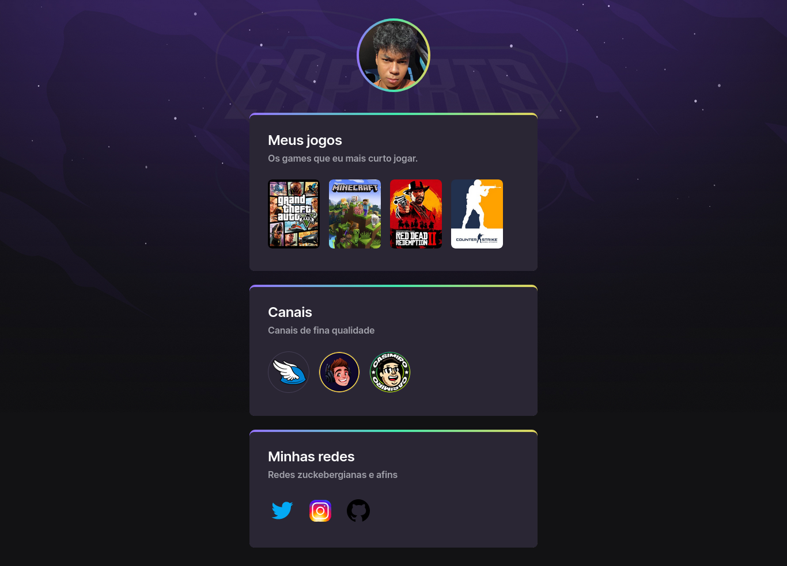

# 🚀 NLW eSports 

## 🧭 Trilha Explorer

> Projeto construído no evento Next Level Week da Rocketseat 2022.

Consiste numa webpage simples que cataloga meus jogos e canais favoritos, além das minhas redes sociais.

[🔗 Clique aqui para acessar](https://miask3011.github.io/nlw-esports-explorer/)

## 🛠️ Tecnologias

</img>

</img>

## 📮 Contato

> ✉️ neemiascalebe2014@gmail.com